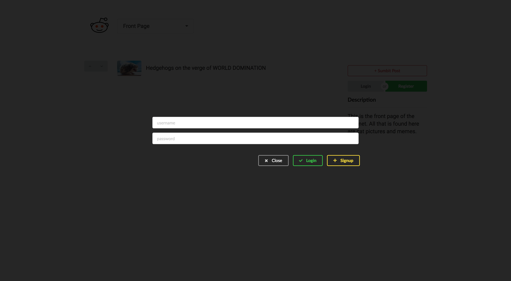
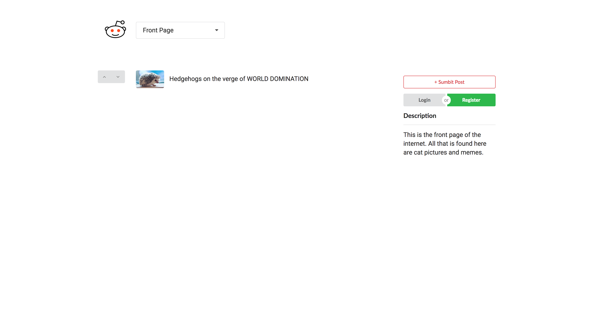

# Reddit | Day 1

## Part 0: Schema Design
Based on the functionality described within this exercise, create a potential schema for your SQL models. Once you've mapped out an appropriate design, get it approved by one of the instructors. **DO NOT BEGIN THE PROJECT UNTIL IT HAS BEEN APPROVED.**

## Part 1: Setup
1. ONE team member should fork the [React Redux Express Template](https://github.com/horizons-school-of-technology/react-redux-express-template)
1. All team members should then clone the forked repository
    - Run `npm install`: You may alternatively run the `yarn` command if you so desire
    - Run `npm run dev`: This command will run **BOTH** the backend server and webpack for frontend
    - Note that this repository includes both a frontend & a backend within the *same* folder structure
1. Implement `body-parser` in your app
    <details><summary>
    Solution
    </summary><p>

    1. Install `body-parser` in your application by running the following command `npm i -S body-parser`
    1. Require the package at the top of your `/server.js` file
    1. Add the below lines of code to ensure that it's being used as middleware
        ```js
        app.use(bodyParser.json());
        app.use(bodyParser.urlencoded({ extended: false }));
        ```

    </p></details>

## Part 2: React Router
The template you are working with does not include React Router. This application will require the use of React Router, so before you begin we highly recommend implementing it. We recommend trying this out for yourself, but if you run into any problems you may look at the setup instructions (found within the *Hint* block below).

<details><summary>
Hint
</summary><p>

1. `npm install --save react-router-dom`
1. Navigate to `/frontend/containers/Root.dev.js`
1. Import the necessary components from `react-router-dom`
    ```js
    import { HashRouter, Route, Switch } from 'react-router-dom';
    ```
1. Surround the `AppContainer` with `HashRouter` and `Switch` (a Router component can only have one child, so `Switch` allows us to define multiple routes and display a single component at a time).
1. *Inside the `Switch` component* create a route that renders the component `AppContainer` for *exact* path `/` (as shown below). Your code for `Root.dev.js` should look like:
    ```js
    <Provider store={store}>
      <HashRouter>
        <Switch>
          <Route exact path='/' component={AppContainer}/>
        </Switch>
      </HashRouter>
    </Provider>
    ```
1. Navigate to `localhost:3000` and make sure your App still shows up

</p></details>

## Part 3: `sequelize`
Before we can get started on any functionality, let's implement sequelize.

1. First let's run `npm install --save sequelize pg pg-hstore` to include the sequelize package and its required dependencies in your application
1. Create a new *local* PostgreSQL database called **reddit** (use the `CREATE DATABASE` command)
1. Write an `env.sh` file and export `DATABASE_URL` and `DATABASE_NAME`. Don't forget to export `DATABASE_PASSWORD` if you're on Windows!
    - **On a Mac your `env.sh` should contain:**
        ```sh
        export DATABASE_URL=postgresql://postgres@localhost/[DATABASE-NAME-HERE]
        export DATABASE_NAME=[DATABASE-NAME-HERE]
        ```

    - **On Windows your `env.sh` should contain:**
        ```sh
        export DATABASE_URL=postgresql://postgres:YOUR POSTGRES PASSWORD HERE@localhost/[DATABASE-NAME-HERE]
        export DATABASE_NAME=[DATABASE-NAME-HERE]
        # Use the password you set during Postgres installation
        export DATABASE_PASSWORD=[DATABASE-PASSWORD-HERE]
        ```
1. `source env.sh`
1. Navigate to the root folder of your application and add a `models.js` file with the following starter code.
    ```js
    "use strict";

    var Sequelize = require('sequelize');
    var sequelize = new Sequelize(process.env.DATABASE_NAME, 'postgres', process.env.DATABASE_PASSWORD, {
        dialect: 'postgres'
    });

    sequelize
    .authenticate()
    .then(() => {
        console.log('Connection has been established successfully.');
    })
    .catch(err => {
        console.error('Unable to connect to the database:', err);
    });

    // MODELS GO HERE

    module.exports = {
        sequelize,
        // EXPORT models HERE
    };
    ```
1. Run `node models.js` and you should see:
    ```sh
    Connection has been established successfully.
    ```
1. Create a `sync.js` file with the below starter code. You will not be required to use migrations for this exercise, so when you make changes to your schema your tables will have to be dropped (and then re-created). The [`sync`](http://docs.sequelizejs.com/class/lib/sequelize.js~Sequelize.html#instance-method-sync) method used below, in conjunction with the `force: true` param, will run a `DROP TABLE IF EXISTS` command for **each** model. So after **every** schema change you should run `node sync.js` to update your database.
    ```js
  	"use strict";

    var models = require('./models');

    models.sequelize.sync({ force: true })
    .then(function() {
      console.log('Successfully updated database tables!');
  		process.exit(0);
  	})
  	.catch(function(error) {
          console.log('Error updating database tables', error);
  		process.exit(1);
  	});
    ```
1. Using the schema you designed in **Part 0** build your models in `models.js` where it says `// MODELS GO HERE`. If you're unsure of how to start, check out the hint below for an example of creating a User model with a username and a password.
    <details><summary>
    Hint
    </summary><p>

    ```js
    var User = sequelize.define('user', {
      id: {
        type: Sequelize.INTEGER,
        primaryKey: true,
        autoIncrement: true
      },
      username: {
        type: Sequelize.STRING,
        allowNull: false,
        unique: true
      },
      password: {
        type: Sequelize.STRING,
        allowNull: false
      },
      // ADD MORE ATTRIBUTES HERE
    });
    ```

    </p></details>
1. Navigate to `/server.js` and implement `passport` (incl. `LocalStrategy`, `deserializeUser`, `serializeUser`)
    - Remember that you've already done this for the `orm` exercise!

#### Goal
To make sure you've properly connected to/created your database perform the following set of steps:

1. Run `node sync.js`. It should exit after printing `Successfully updated database tables!` to terminal.
1. Open `pgweb` & refresh the page
1. Make sure that all of the tables you added to your models show up in `pgweb`
1. Click on the **Structure** tab and make sure that the structure matches your schema
    - Note that `sequelize` will add `createdAt` and `updatedAt` attributes of type `Sequelize.DATE` to each table
    - `createdAt`: The timestamp for when an entry was added to the database
    - `updatedAt`: The timestamp for when the entry was last modified (initially equal to the `createdAt` timestamp)

## :warning: :warning: :warning: **IMPORTANT DISCLAIMER** :warning: :warning: :warning:
We will soon be starting the frontend section of this assignment. We strongly advise you to **NOT** focus on styling your application until after you're done.

Also, you will need to create a Modal in the next part, and you may want to use one of [`react-bootstrap`](https://react-bootstrap.github.io/getting-started.html) or [`semantic-ui-react`](https://react.semantic-ui.com/introduction). **DO NOT** use both together as that will cause problems.

## Part 4: FrontPage
Now that you've completed all the boring setup stuff, let's create some components! The `AppContainer` will serve as the Front Page for the remaining set of instructions.

1. Within the `AppContainer` render `Header`, `Feed` and `SideBar` components (you will have to create these files in the `/frontend/components` folder)
    - `Header`: Consists of **logo** and **title**
    - `Feed`: List of all posts
    - `SideBar`: Render the following components within `SideBar`
        - `SubmitPost`: A button to submit a new post
        - `Login` & `Register`: Login and Register buttons
        - `Description`: The description of the current subreddit
1. Create a `Modal` for both Login & Registration. Since both functions only require a `username` & `password` you can just make one modal with two buttons (like below). This modal should be hidden unless `isModalOpen` is set to `true` in Redux state.
    
1. Add `isModalOpen` to Redux state and initially set it to `false`
1. Add a `TOGGLE_LOGIN_MODAL` action to action types, and export a `toggleLoginModal` action creator function from `/frontend/actions/index.js`
1. Create a `toggleLoginModal()` reducer which should get called when the `TOGGLE_LOGIN_MODAL` action gets dispatched. This reducer should set the value of `state.isModalOpen` to `!state.isModalOpen`
1. When the `Login` or `Register` buttons are clicked you should fire a `TOGGLE_LOGIN_MODAL` action

#### Goal
This is what your page should contain (except for the post and the upvote/downvote button).



## Part 5: User Routes
Now that you have a frontend with Login/Register functionality, let's make the corresponding routes! Remember that you should be using `sequelize` as your ORM. **Note** that you will be working out of the `backend/routes.js` file. To test your routes use [Postman](https://www.getpostman.com/).

**REMEMBER:** We will be using express to make backend routes, so there will be no view engine (handlebars) and no rendering of pages.

Additionally, these instructions will require you to extensively look at the [sequelize docs](http://docs.sequelizejs.com/class/lib/model.js~Model.html).

1. Perform a `GET` request via Postman to the `/api/users` route & make sure you get `{success: true}` as your response (this route already exists)
    - Once you get this response navigate to `/backend/routes.js` and delete this route
1. Require your `/models.js` file at the top of your `/backend/routes.js` file so that you can get access to your model declarations. These will help you create, modify, and delete the data in your database.
1. Create the following `user` routes:
    - `/user`
        - `POST /register`: Given a `username` and `password`, create a new entry in your `users` table. Remember that we can use [`.create()`](http://docs.sequelizejs.com/class/lib/model.js~Model.html#static-method-create) to INSERT data into our tables. If user registration is successful, this route should respond with the newly created user.
        - `POST /login`: Use the `passport` LocalStrategy implementation you wrote on an earlier part to authenticate users. On a successful login you should send back the user object in the response (make sure that the password isn't included in the response)
        - `GET /logout`: End the current session
        - `GET /[username]`: Server should respond with a user object for the `username` entered as a param (make sure that the password isn't included in the response)
        - `GET /`: This is the `/api/user` route. Server should respond with user information for the current user (keep in mind that for security purposes you should not send the password in this request)

## Part 6: `axios`
In this section we'll use `axios` to connect our frontend with our backend!

1. Run `npm i -S axios`
1. Add [`refs`](https://reactjs.org/docs/refs-and-the-dom.html) to the input boxes for the `username` and the `password`. We can use these to later access their values. Note that you cannot use `refs` on stateless components, so you will have to use `class [class-name] extends React.Component { ... }` for your Modal instead.
    ```js
    // BAD - DO NOT DO
    const MyComponent = ( props ) => {
      return (
        <input type="text" name="textInput" ref={(input) => { this.textInput = input; }} />
      );
    }

    // OK
    class MyComponent extends React.Component {
      constructor(props) {
        super(props);
      }
      render() {
        return (
          <input type="text" name="textInput" ref={(input) => { this.textInput = input; }} />
        );
      }
    }
    ```
1. Create two `onClick` functions (one for the `Login` button, and one for the `Register` button)
    - `handleRegister`: Perform a `POST` request on `/api/users/register`. You should use the `refs` you created, to send user input to your backend. On successful registration your route responds with the newly created user. Since `axios` uses promises you can write a `.then()` after the request, and then store the user data in redux. To do this you should:
        1. Create a new action type denoted `LOGIN`
        1. Create an action creator function that takes in a `user` and creates a corresponding action
        1. Modify your reducer to handle the new action, and add the user's information to state
    - `handleLogin`: Perform a `POST` request on `/api/user/login`. You should use the `refs` you created, to send user input to your backend. Similar to `handleRegister` you should use `axios` to perform the `POST` request, and then dispatch a `LOGIN` action with the user's data (the `/api/user/login` route should also return user data for the recently logged in user).

1. Modify your `SideBar` so that once a user has logged in, they see their `username` *instead of* the `Login` and `Register` buttons
1. **If** a user is logged in, then they should also see a `Logout` button on the `SideBar` (you must create this button)
    - The onClick function for this button will make a `GET /api/user/logout` request **AND** remove the user's data from state

## Part 7: Posts
Let's figure out how to create posts! One key concept to note is the structure of our models:

- A user has many posts
- A post belongs to a user
- A post has many posts [as comments]
- A post belongs to a post [as parent]

With this structure we do not need to create a separate model declaration for comments. The **post has many post** relation means that the target model will be given a `postId` as a foreign key referring to the declaring model. So any post with a `postId` value of null is a top-level post, while all other posts are comments.

Let's figure out how to get posts working!

1. Navigate to `/models.js` and if you haven't done so already, add any/all [associations](http://docs.sequelizejs.com/manual/tutorial/associations.html) you will need for this part
    - For the `post has many post` & `post belongs to post` relationship you would do something like the following:
        ```js
        Post.hasMany( Post, { as: 'children', foreignKey: 'postId' } );
        Post.belongsTo( Post, { as: 'parent', foreignKey: 'postId' } );
        ```
    - Try any figure out the rest of the associations by yourself
1. Create a `NewPost` component in the `/frontend/components` folder
    - Make sure that this is **NOT** a stateless component (so it should use `class [class-name] extends React.Component`), as we will be using `refs` in this section)
1. Within the `<Switch>` you should render the `NewPost` component on the `/post/new` route
1. The `NewPost` component should have the following elements:
    - `<input>`: Title of post
    - `<textarea>`: Content of post
    - `<input>`: Links/attachments
    - `<button>`: Save the post
1. Add an onClick to the **+ Submit Post** button from your `SideBar` component. This function will do one of two things:
    - IF the user is logged in then they will get redirected to the `/post/new` route
    - IF the user is **not** logged in then it will dispatch the `TOGGLE_LOGIN_MODAL` action (prompting the user to log in)
1. Create an onClick function for the **Submit** button from your `NewPost` component. Use `axios` to execute a `POST` request to `/api/post/new` with all data.
    - Upon a successful response you should reroute the user to the Front Page (keep in mind that we have not implemented the `/api/post/new` route yet, so it will not work as of now)
1. Navigate to `/backend/routes.js` and add a `POST /api/post/new` route. This route should insert the given information into postgres, and respond with `{success: true}`. Keep in mind that when we implement comment creating we will include a `postId` in `req.body`, but for top-level posts (such as the one we just implemented) there will be no `postId` present. So, in your `.create()` function you should include the `postId` key in the object.
1. Let's create another route! Create the `GET /api/post/all` route. Within this route you should perform a [`.findAll()`](http://docs.sequelizejs.com/class/lib/model.js~Model.html#static-method-findAll) search query where `postId` is `null` (to filter out any comments), and then respond with this object.
1. Navigate to your `Feed` component and on `componentDidMount` perform a `GET /api/post/all` request. Once you receive a response from the server, you should render a list of all posts.
1. **[CHECKPOINT]**: At this point you should successfully be able to create new top-level posts, and then be able to view them on the front page.

## Break Time
You got through Day 1! Now go catch some z's. Big day tomorrow!
