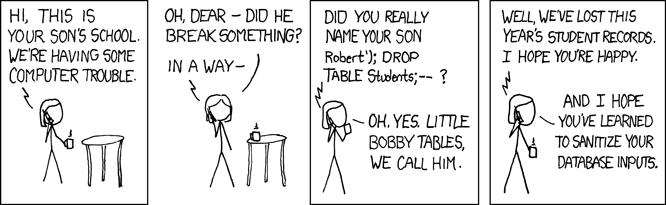

# Reddit Exercise

This will be the final project for the SQL Module. Over the next two days you will use what you've learned to create a clone of Reddit. You are required to create **both** a frontend & a backend for this application.

Required Stack:
- Frontend
    - [React](https://reactjs.org/)
    - [Redux](https://redux.js.org/)
    - [React Router](https://reacttraining.com/react-router/web/guides/philosophy)
- Backend
    - [sequelize.js](http://sequelize.readthedocs.io/en/v3/): ORM
    - [PostgreSQL](https://www.postgresql.org/docs/): Database System

The provided set of instructions start off heavily guided, but eventually become increasingly abstract. This structure will hopefully ease you into the exercise. **Note** that this is a long exercise, so pace yourself accordingly. **BEFORE YOU BEGIN** you must create a potential schema and get it approved by one of the instructors.

## [Day 1](./Day1.md)
This day will cover schema design, react router implementation, sequelize implementation, passport implementation, user registration/login, setting up associations, post creation, and viewing all posts.

## [Day 2](./Day2.md)

*Source: [https://xkcd.com/327/](https://xkcd.com/327/)*
